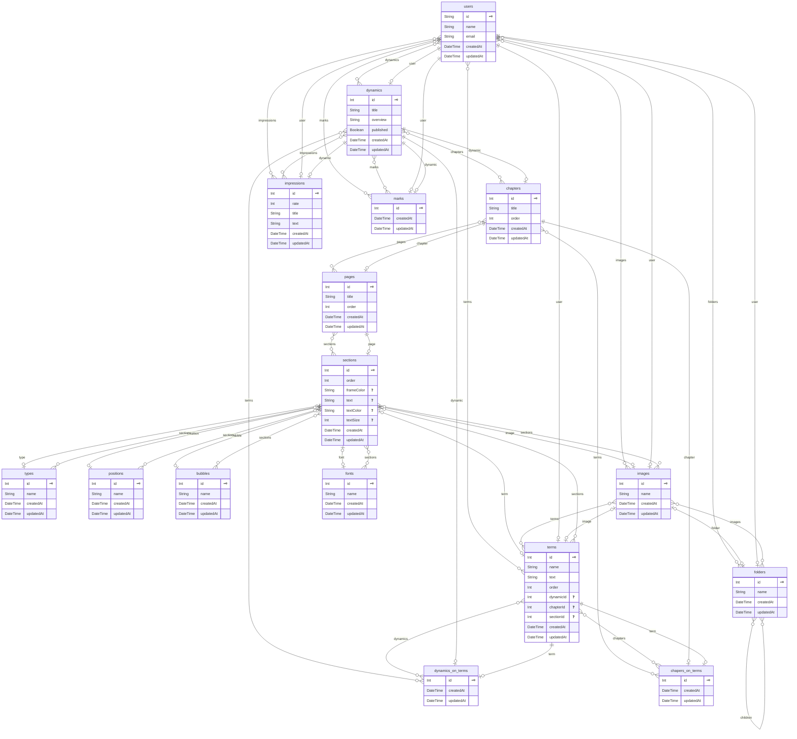

```mermaid
erDiagram

  "users" {
    String id "🗝️"
    String name 
    String email 
    DateTime createdAt 
    DateTime updatedAt 
    }
  

  "dynamics" {
    Int id "🗝️"
    String title 
    String overview 
    Boolean published 
    DateTime createdAt 
    DateTime updatedAt 
    }
  

  "chapters" {
    Int id "🗝️"
    String title 
    Int order 
    DateTime createdAt 
    DateTime updatedAt 
    }
  

  "pages" {
    Int id "🗝️"
    String title 
    Int order 
    DateTime createdAt 
    DateTime updatedAt 
    }
  

  "sections" {
    Int id "🗝️"
    Int order 
    String frameColor "❓"
    String text "❓"
    String textColor "❓"
    Int textSize "❓"
    DateTime createdAt 
    DateTime updatedAt 
    }
  

  "folders" {
    Int id "🗝️"
    String name 
    DateTime createdAt 
    DateTime updatedAt 
    }
  

  "impressions" {
    Int id "🗝️"
    Int rate 
    String title 
    String text 
    DateTime createdAt 
    DateTime updatedAt 
    }
  

  "marks" {
    Int id "🗝️"
    DateTime createdAt 
    DateTime updatedAt 
    }
  

  "types" {
    Int id "🗝️"
    String name 
    DateTime createdAt 
    DateTime updatedAt 
    }
  

  "positions" {
    Int id "🗝️"
    String name 
    DateTime createdAt 
    DateTime updatedAt 
    }
  

  "bubbles" {
    Int id "🗝️"
    String name 
    DateTime createdAt 
    DateTime updatedAt 
    }
  

  "images" {
    Int id "🗝️"
    String name 
    DateTime createdAt 
    DateTime updatedAt 
    }
  

  "fonts" {
    Int id "🗝️"
    String name 
    DateTime createdAt 
    DateTime updatedAt 
    }
  

  "terms" {
    Int id "🗝️"
    String name 
    String text 
    Int order 
    Int dynamicId "❓"
    Int chapterId "❓"
    Int sectionId "❓"
    DateTime createdAt 
    DateTime updatedAt 
    }
  

  "dynamics_on_terms" {
    Int id "🗝️"
    DateTime createdAt 
    DateTime updatedAt 
    }
  

  "chapers_on_terms" {
    Int id "🗝️"
    DateTime createdAt 
    DateTime updatedAt 
    }
  
    "users" o{--}o "dynamics" : "dynamics"
    "users" o{--}o "terms" : "terms"
    "users" o{--}o "marks" : "marks"
    "users" o{--}o "impressions" : "impressions"
    "users" o{--}o "folders" : "folders"
    "users" o{--}o "images" : "images"
    "dynamics" o|--|| "users" : "user"
    "dynamics" o{--}o "chapters" : "chapters"
    "dynamics" o{--}o "impressions" : "Impressions"
    "dynamics" o{--}o "marks" : "marks"
    "dynamics" o{--}o "dynamics_on_terms" : "terms"
    "chapters" o|--|| "dynamics" : "dynamic"
    "chapters" o{--}o "pages" : "pages"
    "chapters" o{--}o "chapers_on_terms" : "terms"
    "pages" o|--|| "chapters" : "chapter"
    "pages" o{--}o "sections" : "sections"
    "sections" o|--|| "pages" : "page"
    "sections" o|--|o "types" : "type"
    "sections" o|--|o "positions" : "position"
    "sections" o|--|o "bubbles" : "bubble"
    "sections" o|--|o "images" : "image"
    "sections" o|--|o "fonts" : "font"
    "sections" o|--|o "terms" : "term"
    "folders" o|--|| "users" : "user"
    "folders" o|--|o "folders" : "parent"
    "folders" o{--}o "folders" : "children"
    "folders" o{--}o "images" : "images"
    "impressions" o|--|| "users" : "user"
    "impressions" o|--|| "dynamics" : "dynamic"
    "marks" o|--|| "users" : "user"
    "marks" o|--|| "dynamics" : "dynamic"
    "types" o{--}o "sections" : "sections"
    "positions" o{--}o "sections" : "sections"
    "bubbles" o{--}o "sections" : "sections"
    "images" o|--|| "users" : "user"
    "images" o|--|o "folders" : "folder"
    "images" o{--}o "sections" : "sections"
    "images" o{--}o "terms" : "terms"
    "fonts" o{--}o "sections" : "sections"
    "terms" o|--|| "users" : "user"
    "terms" o|--|o "images" : "image"
    "terms" o{--}o "dynamics_on_terms" : "dynamics"
    "terms" o{--}o "chapers_on_terms" : "chapters"
    "terms" o{--}o "sections" : "sections"
    "dynamics_on_terms" o|--|| "dynamics" : "dynamic"
    "dynamics_on_terms" o|--|| "terms" : "term"
    "chapers_on_terms" o|--|| "chapters" : "chapter"
    "chapers_on_terms" o|--|| "terms" : "term"
```
