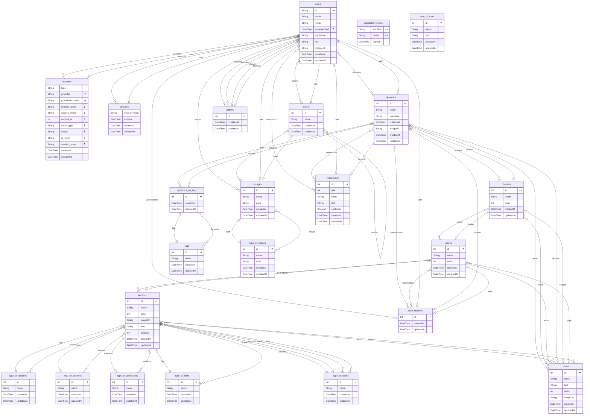

```mermaid
erDiagram

  "users" {
    String id "🗝️"
    String name 
    String email 
    DateTime emailVerified "❓"
    String penName 
    String text 
    String imageUrl 
    DateTime createdAt 
    DateTime updatedAt 
    }
  

  "accounts" {
    String type 
    String provider "🗝️"
    String providerAccountId "🗝️"
    String refresh_token "❓"
    String access_token "❓"
    Int expires_at "❓"
    String token_type "❓"
    String scope "❓"
    String id_token "❓"
    String session_state "❓"
    DateTime createdAt 
    DateTime updatedAt 
    }
  

  "sessions" {
    String sessionToken 
    DateTime expires 
    DateTime createdAt 
    DateTime updatedAt 
    }
  

  "verificationTokens" {
    String identifier "🗝️"
    String token "🗝️"
    DateTime expires 
    }
  

  "dynamics" {
    Int id "🗝️"
    String name 
    String overview 
    Boolean published 
    String imageUrl 
    DateTime createdAt 
    DateTime updatedAt 
    }
  

  "chapters" {
    Int id "🗝️"
    String name 
    Int order 
    DateTime createdAt 
    DateTime updatedAt 
    }
  

  "pages" {
    Int id "🗝️"
    String name 
    Int order 
    DateTime createdAt 
    DateTime updatedAt 
    }
  

  "sections" {
    Int id "🗝️"
    String name 
    Int order 
    String imageUrl 
    String text 
    Int textSize 
    DateTime createdAt 
    DateTime updatedAt 
    }
  

  "folders" {
    Int id "🗝️"
    String name 
    DateTime createdAt 
    DateTime updatedAt 
    }
  

  "images" {
    Int id "🗝️"
    String name 
    String path 
    DateTime createdAt 
    DateTime updatedAt 
    }
  

  "terms" {
    Int id "🗝️"
    String name 
    String text 
    Int order 
    String imageUrl 
    DateTime createdAt 
    DateTime updatedAt 
    }
  

  "tags" {
    Int id "🗝️"
    String name 
    DateTime createdAt 
    DateTime updatedAt 
    }
  

  "dynamics_on_tags" {
    Int id "🗝️"
    DateTime createdAt 
    DateTime updatedAt 
    }
  

  "follows" {
    Int id "🗝️"
    DateTime createdAt 
    DateTime updatedAt 
    }
  

  "impressions" {
    Int id "🗝️"
    Int rate 
    String name 
    String text 
    Boolean published 
    DateTime createdAt 
    DateTime updatedAt 
    }
  

  "view_histories" {
    Int id "🗝️"
    DateTime createdAt 
    DateTime updatedAt 
    }
  

  "type_of_animations" {
    Int id "🗝️"
    String name 
    DateTime createdAt 
    DateTime updatedAt 
    }
  

  "type_of_colors" {
    Int id "🗝️"
    String name 
    DateTime createdAt 
    DateTime updatedAt 
    }
  

  "type_of_fonts" {
    Int id "🗝️"
    String name 
    DateTime createdAt 
    DateTime updatedAt 
    }
  

  "type_of_images" {
    Int id "🗝️"
    String name 
    String ratio 
    DateTime createdAt 
    DateTime updatedAt 
    }
  

  "type_of_positions" {
    Int id "🗝️"
    String name 
    DateTime createdAt 
    DateTime updatedAt 
    }
  

  "type_of_sections" {
    Int id "🗝️"
    String name 
    DateTime createdAt 
    DateTime updatedAt 
    }
  

  "type_of_sorts" {
    Int id "🗝️"
    String name 
    String sql 
    DateTime createdAt 
    DateTime updatedAt 
    }
  
    "users" o{--}o "dynamics" : "dynamics"
    "users" o{--}o "follows" : "following"
    "users" o{--}o "follows" : "followers"
    "users" o{--}o "impressions" : "impressions"
    "users" o{--}o "view_histories" : "viewHistories"
    "users" o{--}o "folders" : "folders"
    "users" o{--}o "images" : "images"
    "users" o{--}o "accounts" : "accounts"
    "users" o{--}o "sessions" : "sessions"
    "accounts" o|--|| "users" : "user"
    "sessions" o|--|| "users" : "user"
    "dynamics" o|--|| "users" : "user"
    "dynamics" o{--}o "chapters" : "chapters"
    "dynamics" o{--}o "impressions" : "impressions"
    "dynamics" o{--}o "view_histories" : "viewHistories"
    "dynamics" o{--}o "terms" : "terms"
    "dynamics" o{--}o "dynamics_on_tags" : "tags"
    "chapters" o|--|| "dynamics" : "dynamic"
    "chapters" o{--}o "pages" : "pages"
    "chapters" o{--}o "terms" : "terms"
    "pages" o|--|| "chapters" : "chapter"
    "pages" o{--}o "sections" : "sections"
    "pages" o{--}o "view_histories" : "viewHistories"
    "pages" o{--}o "terms" : "terms"
    "sections" o|--|| "pages" : "page"
    "sections" o|--|| "type_of_sections" : "type"
    "sections" o|--|o "type_of_positions" : "position"
    "sections" o|--|o "type_of_animations" : "animation"
    "sections" o|--|| "type_of_fonts" : "font"
    "sections" o|--|| "type_of_colors" : "frameColor"
    "sections" o|--|| "type_of_colors" : "textColor"
    "sections" o{--}o "terms" : "term"
    "folders" o|--|| "users" : "user"
    "folders" o|--|o "folders" : "parent"
    "folders" o{--}o "folders" : "children"
    "folders" o{--}o "images" : "images"
    "images" o|--|| "users" : "user"
    "images" o|--|| "type_of_images" : "type"
    "images" o|--|o "folders" : "folder"
    "terms" o|--|o "dynamics" : "dynamic"
    "terms" o|--|o "chapters" : "chapter"
    "terms" o|--|o "pages" : "page"
    "terms" o|--|o "sections" : "section"
    "tags" o{--}o "dynamics_on_tags" : "dynamics"
    "dynamics_on_tags" o|--|| "dynamics" : "dynamic"
    "dynamics_on_tags" o|--|| "tags" : "tag"
    "follows" o|--|| "users" : "follower"
    "follows" o|--|| "users" : "followee"
    "impressions" o|--|| "users" : "user"
    "impressions" o|--|| "dynamics" : "dynamic"
    "view_histories" o|--|| "users" : "user"
    "view_histories" o|--|| "dynamics" : "dynamic"
    "view_histories" o|--|| "pages" : "page"
    "type_of_animations" o{--}o "sections" : "sections"
    "type_of_colors" o{--}o "sections" : "frame"
    "type_of_colors" o{--}o "sections" : "text"
    "type_of_fonts" o{--}o "sections" : "sections"
    "type_of_images" o{--}o "images" : "image"
    "type_of_positions" o{--}o "sections" : "sections"
    "type_of_sections" o{--}o "sections" : "sections"
```
